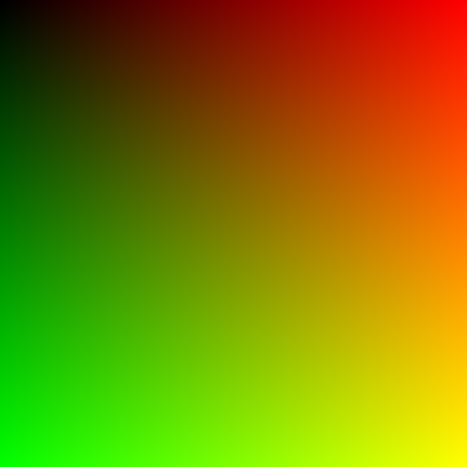

# Exercise 2 - Image generator

In this exercise, you are tasked with drawing an image to the screen, using the pixel rgb values inside of a 512x512 canvas.

The generator makes use of the canvas contexts' ImageData object to render the image. You don't need to worry too much about how this works. All you should know is that the ImageData contains a property called data, which is a list containing all the pixel values for the canvas. Each pixel is defined as 4 values, rgba, and starts from the top left of the canvas, and finishes at the bottom right.

There is a variable called imageDataArray. This is a flat list which is intended to be used by you to write the pixel rgba values sequentially. The final for-loop demonstrates how this variable will be used to create the canvas. The values of this variable are assigned to the ImageData's data object.

Once you have determined how to define the pixel properties, you could experiment with different colour effects and gradients. Have fun and get creative.

Hint: As a starting point, try to render a white background to make sure you are able to render something to the screen.

As an additional challange, try to reproduce the following image:

 

